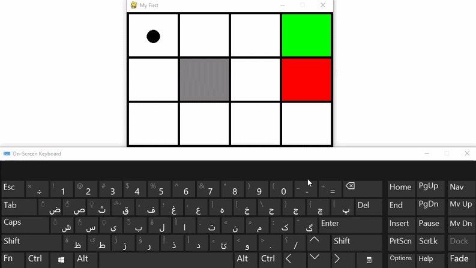

# Simulating the Gridworld 3*4 game and human play with this environment
<p align="center">
  
</p>

In this game, we play with the environment using the keyboard directions (up, down, left, and right) and try to reach our goal, which is the green house.

You can use the "New Episode" button to proceed to the next episode and start the game over.

---

## 📌 Overview


This project provides an interactive 3×4 GridWorld environment designed to help understand the basic concepts of Reinforcement Learning environments.

In this game, a human player can interact with the environment using keyboard arrow keys to move the agent through the grid. The player can observe how actions lead to different states, how rewards are assigned, and how the agent interacts with the environment.

This interactive environment serves as a simple visualization tool for exploring states, actions, transitions, and rewards before implementing Reinforcement Learning algorithms.

---

## Features

- 🎮 Interactive GridWorld gameplay using keyboard arrow keys
- 🗺️ 3×4 grid-based environment visualization
- 🤖 Manual control of the agent to explore states and transitions
- 🎯 Goal and terminal states for understanding environment dynamics
- 🔄 Stochastic transitions with predefined probabilities
- 💰 Reward-based interaction between agent and environment
- 📍 Visualization of states, actions, and agent movements
- 🧠 Educational environment for understanding Reinforcement Learning concepts
- ⚙️ Built with Gymnasium for Reinforcement Learning experiments

---

## Technologies

| Technology | Purpose                                      |
| ---------- | -------------------------------------------- |
| 🐍 Python  | Core programming language                    |
| 🎮 Gymnasium | Environment creation and simulation        |
| 🕹️ Pygame | Interactive visualization and user input     |

---

## Installation


Install the required dependencies:

```bash
pip install pygame sys gymnasium
```

---

## Run the Application

```bash
python main.py
```

Use the keyboard arrow keys to control the agent and interact with the 3×4 GridWorld environment.

⬆️ Move Up
⬇️ Move Down
⬅️ Move Left
➡️ Move Right

## Concepts Demonstrated

This project provides a practical introduction to several important Reinforcement Learning concepts:

* **GridWorld Environment**
* **Agent-Environment Interaction**
* **States and Actions**
* **Rewards and Terminal States**
* **State Transitions and Transition Probabilities**
* **Stochastic Environments**
* **Markov Decision Process (MDP)**
* **Policy and Decision Making**
* **Reinforcement Learning Fundamentals**
* **Environment Visualization and Interaction**

---

## 🚀 Future Improvements

Possible extensions of this project include:
* ✅ Interactivity
* ✅ Use keyboard directions to play
* ✅ Graphic environment
* ✅ Show rewards and modes in the game environment
* ✅ Make the graphical environment more beautiful
* [ ] etc.

---


## 👤 Author

**Abbas Nikbakht**

This project is used to understand game environments used in reinforcement learning, and this project was conducted to understand these environments.

